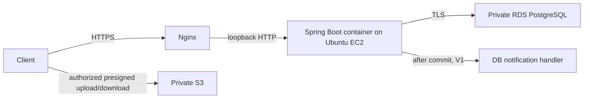

# Architecture overview

DormFix is one deployable Java 21 Spring Boot modular monolith backed by PostgreSQL, with private S3 binaries. Modules are Java packages, not independently deployed services. Phase 0 ships health/security/logging wiring and build controls; it does not ship business behavior.

[Backend](backend-architecture.md), [aggregates](aggregate-boundaries.md), [transactions](transaction-boundaries.md), [events](domain-events.md), [database](database.md), [security](security.md), [observability](observability.md) and [deployment](deployment.md) specify the boundaries. [ADRs](../adr/README.md) record decisions; [review notes](open-questions.md) explicitly preserve unresolved product questions. Architecture baseline acceptance awaits human review; frozen V1 product authority is already established.

Use one backend Gradle build to avoid premature modules/build orchestration. frontend/ is a documented placeholder. infra/ contains local/production templates, docs/ contracts and runbooks, scripts/ repository checks, .github/ CI and review templates. No Redis, message broker, AI, distributed transactions, Kubernetes or outbox in Phase 0/V1.
