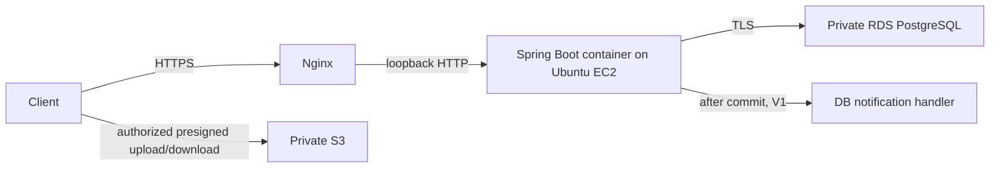

# Architecture overview

DormFix는 PostgreSQL과 private S3 binary를 사용하는 하나의 deployable Java 21 Spring Boot modular monolith다. Module은 Java package이며 독립 배포 service가 아니다. Phase 0은 health/security/logging wiring과 build control만 제공한다.

[Backend](backend-architecture.md), [aggregate](aggregate-boundaries.md), [transaction](transaction-boundaries.md), [event](domain-events.md), [database](database.md), [security](security.md), [observability](observability.md), [deployment](deployment.md)가 경계를 정의하고 [ADR](../adr/README.md)이 decision을 기록한다. 미해결 product 질문은 [review note](open-questions.md)에 보존한다.

하나의 backend Gradle build로 premature module orchestration을 피한다. frontend/는 placeholder이고 infra/는 template/runbook, scripts/는 repository check, .github/는 CI/review template을 담는다. Phase 0/V1에는 Redis, broker, AI, distributed transaction, Kubernetes, outbox를 추가하지 않는다.
